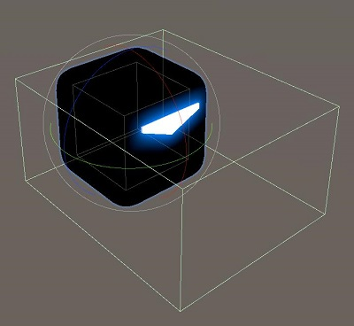
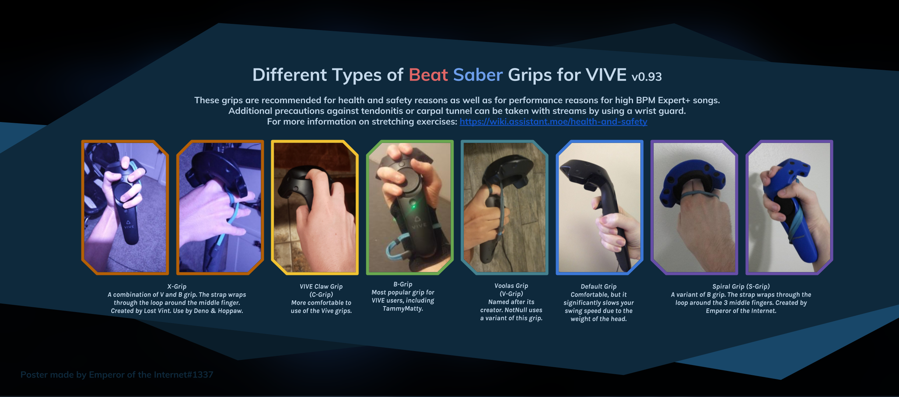
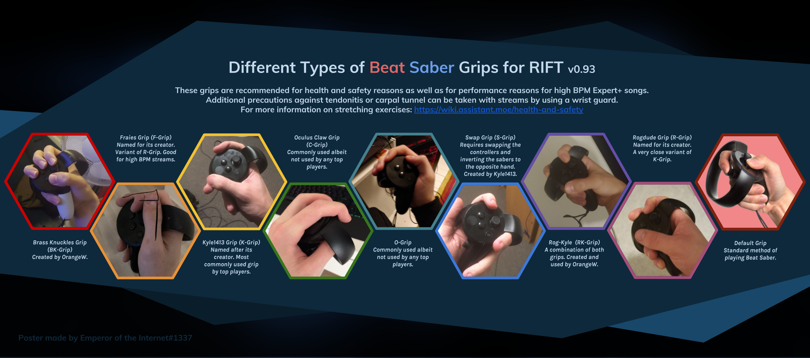
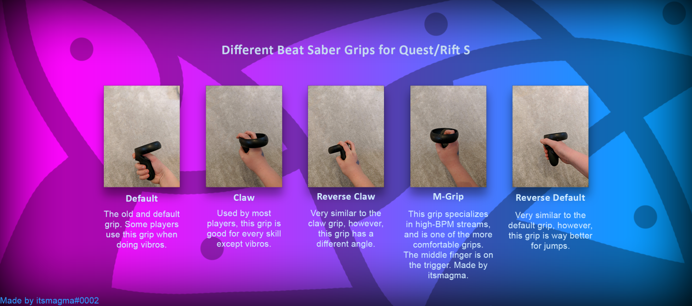
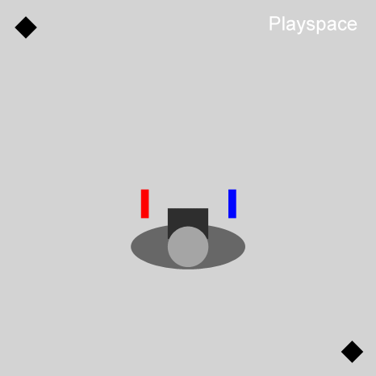
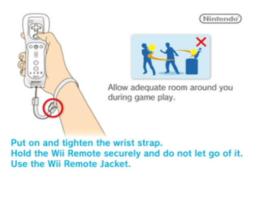

# Controllerhaltung und Ranking
_Eine Sammlung von Informationen, die Dir helfen sollen, das Score-System zu verstehen und bessere Rankings zu erziehlen_

## Ranking Mega-Tutorial
Eine sehr gute Zusammenfassung von TeknozFR, wie Du PP generierst findest Du hier:  
[https://bsaber.com/indepth-guide/](https://bsaber.com/indepth-guide/)

## Score-System
Sieh Dir das folgende Video von [Cube Community YT](https://www.youtube.com/channel/UCdG9zS8jVcQIKl7plwWXUkg) an, in dem erklärt wird, wie das Score-System funktioniert:

<YouTube url='https://www.youtube.com/watch?v=rVbXCGddspA' />

Zusätzlich gibt es hier ein Bild der Entwickler, welches zeigt, wie die [Hitboxen](https://twitter.com/Split82/status/979365834324889600) der Blöcke aussehen:

## Ranking
*Wie funktioniert das globale Ranking? Was sind Performance Points? Was bedeuten die Zahlen in den Klammern hinter meinem Namen? Warum sind meine PP so niedrig?*

Du findest Deine aktuelle Platzierung im globalen Ranking und Deine PP auf [ScoreSaber](https://scoresaber.com/global) - hier kannst Du nach Deinem Nickname suchen. Dein ScoreSaber-Account ist mit Deinem Steam / Oculus Benutzernamen verbunden.

1. Ranked-Songs sind eine bestimmte Anzahl von PP zugeordnet (PP = Performance Points). Die exakte Anzahl von PP die Du erhältst, hängt von der Genauigkeit ab, mit der Du einen Ranked-Song beendest. Wie viele PP Du genau erhältst, wird von einem geheimen Algorithmus bestimmt, der von unserem Panda-Gott Umbranox entwickelt wird.
2. Um zu verhindern, dass gute Spieler viele einfache Songs spielen, die wenige PP wert sind, wird eine Kurvenfunktion auf deine Spieldurchläufe angewendet. Diese Kurvenfunktion ist 0.965^(x-1), wobei x die Position des Scores auf Deiner Song-Liste ist.
Wenn Du z.B. in Deinem besten Durchlauf 260 PP erzielt hast, wirst Du hierfür 260 gewichtete PP erhalten, was 100% der Grundpunkte des Durchlaufs entspricht. Wenn Du mit Deinem zweiten Durchlauf 247 Grundpunkte erziehlst, wirst Du hierfür 238 gewichtete PP erhalten, was der tatsächlichen Anzahl von PP entspricht, nach dem die Kurvenfunktion angewendet wurde. Im folgenden sind meine vier besten Durchläufe zu sehen. Hierbei sind die Grundpukte in kursiv und die gewichteten Punkte in fett dargestellt.

| |
| --- | 
| _260pp_ -> **260pp** (100% der Grundpunkte) |
| _247pp_ -> **238pp** (96.5% der Grundpunkte) |
| _246pp_ -> **229pp** (93.1% der Grundpunkte) |
| _244pp_ -> **219pp**  (89.9% der Grundpunkte) |

3. Um im Rang aufzusteigen, solltest Du neue Songs spielen, die mehr oder ähnlich viele Punkte wert sind, wie Deine Top-Songs. Wenn Du keine neuen Songs hast, die mehr PP wert sind, kannst Du die Songs auf Deiner ersten Seite erneut spielen, um zu versuchen einen besseren Score zu erreichen. Hier findest Du [eine Tabelle von DuoVR](https://docs.google.com/spreadsheets/d/1ufWgF2tWS0gD3pIr0_d37EkIcmCrUy1x6hyzPEZDPNc/edit#gid=1775412672), die alle Ranked-Songs enthält und Dir zeigt, wie viele PP diese wert sind. Die Tabelle wird alle 24 Stunden aktualisiert.

Hier findest Du eine weitere Seite von [DuoVR](https://duovr.github.io/BigPP/), in der Du dein ScoreSaber-Profil eingeben kannst, um zu erfahren, welche Songs Du Spielen solltest, um viele PP zu erhalten.

*Der folgende Abschnitt basiert auf der Zusammenfassung von Tek im Beat Saber Canadian Discord.*

::: tip
Ob Songs für das Ranking zählen oder nicht, wird vom Ranking-Team auf dem [ScoreSaber Discord](https://discord.gg/WpuDMwU) entschieden.  
Du kannst den Prozess auf Discord verfolgen, um mitzubekommen welche Änderungen sich ergeben!
:::

## Controllerhaltung
Die [Cube Community](https://discord.gg/dwe8mbC) hat ein paar Videos produziert, welche die bekanntesten Controllerhaltungen für die Oculus Touch-Controller (CV1) und die HTC Vive Controller zeigen.

### HTC Vive
<YouTube url='https://www.youtube.com/watch?v=G7x_wb7RrgU' />

### Oculus Rift
<YouTube url='https://www.youtube.com/watch?v=XFt90q69aEA' />

### Oculus Rift S und Quest
Für die Rift S und Quest Controller gibt es noch kein Video, jedoch kannst Du ein paar zusätzliche Beispiele zum unten gezeigten Bild im `#tips-and-grips` Channel des [CC Discords](https://discord.gg/dwe8mbC) finden.  

### Valve Index
Für die Valve Index existieren ebenfalls noch keine Videos, jedoch kannst Du auch hier Beispiele im `#tips-and-grips` Channel auf [Discord](https://discord.gg/dwe8mbC) finden.

## Veresserungen am Vive Controller-Tracking
Vielleicht blockiert Dein Körper die Sicht zwischen einer der Lighthouse-Basisstationen und einem Deiner Controller.
Nachfolgend findest Du ein paar Empfehlungen, die vielleicht Dein Tracking verbessern können:

1. Stelle Dich in die Ecke Deines Spielbereiches.
2. Stelle dich in einem 45°-Winkel auf, sodass beide Lighthouse-Basisstationen Deine Controller sehen können. 
3. Rotiere den Raum in den Einstellungen von Beatsaber so, dass Du innerhalb des Spiels wieder nach vorne schaust.

Diese Tricks können ebenfalls auf die Oculus-Sensoren angewendet werden.

## Touch Controller Batterie-Kontaktprobleme
Die Fliehkräfte, welche durch Deine Controllerbewegungen in Beatsaber erzeugt werden, können dazu führen, dass die Feder im Batteriefach Deiner Touch-Controller zusammengedrückt wird und die Batterie somit für einen kurzen Moment den Kontakt verliert. Dies ist der Fall, wenn Du siehst, dass Dein Schwert das Positions-Tracking verliert, sich jedoch an Ort und Stelle noch weiterdreht. Um diesem Problem entgegen zu wirken, empfiehlt ragesaq eine zusätzliche Feder im Batteriefach zu verbauen, die den Anpressdruck der Batterie erhöht. Mehr dazu findest Du in [diesem Reddit-Post](https://www.reddit.com/r/oculus/comments/a2h7o4/psa_adding_an_additional_spring_to_the_battery/?st=JR9Q7OEZ&sh=a7a3d091).

## Beachte auch: Deine Spielumgebung

