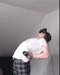

# Gesundheit und Sicherheit
_Du kannst keine Blöcke ohne Deine Arme treffen!_

## Generelle Tipps
Beat Saber kann ein körperlich sehr anstrengendes Spiel sein. Aus diesem Grund ist es wichtig, dass Du Deine Spielzeiten wie ein richtiges Workout behandelst. Wir empfehlen sehr, dass Du Dich vor jedem Spielen dehnst und aufwärmst, um Deine Handgelänke und Schultern vor Schäden zu schützen. Eine häufige Folge von falscher Vorbereitung kann z.B. das [Repetitive-Strain-Injury-Syndrom (RSI)](https://de.wikipedia.org/wiki/Repetitive-Strain-Injury-Syndrom) bei Schultern und Handgelenken sein. 

Du solltest Dich **nicht nur** dehnen, wenn Du planst sehr schwere Songs zu spielen, denn selbst wenn eine BeatMap einfach aussieht, kannst Du Dich beim Spielen ernsthaft verletzen.

::: warning WICHTIG
_Denke immer daran, viel zu Trinken und immer weiter zu atmen!_
:::

## Tino's Anleitung zum Aufwärmen und die Erholung von Verletzungen
Tino ist einer der Top-10-Spieler in Kanada und er hat freundlicherweise einen sehr ausführlichen Leitfaden verfasst, in dem es um das richtige Aufwärmen, die Erholung und die Linderung von Verletzungen geht. [Lies Dir den Leitfaden hier durch!](https://docs.google.com/document/d/122rd-eU0mkwQ6fXUwSmo1_XAh73Jyqd1u6ncrUjtkD0/)

## Deine Handgelenke
### Gewichte?
Generell empfehlen wir Dir, **keine** Gewichte beim Spielen zu verwenden. Beat Saber ist bereits ein Training für sich und viele Spieler verletzen sich auch schon ohne Gewichte. Du setzt Deine Handgelenke im Grunde einem ständigen Schleudertrauma aus und das Verwenden von Gewichten macht die Sache nur noch schlimmer.

Wenn Du unbedingt darauf bestehst, Gewichte zu verwenden, schaue Dir bitte zumindest [diesen Leitfaden](https://www.vrfitnessinsider.com/beat-saber-weighted-gear/) von VR Fitness Insider an, um Dein Verletzungsrisiko zu minimieren.

### Tipps von Dr. Levi Harrison
Dr. Levi hat mit seinen Videos unzähligen Spielern das Handgelenk gerettet und er hat ein Video produziert, das speziell einige Übungen zeigt, um Verletzungen beim Spielen von Beat Saber zu vermeiden! Wir können Dir seine Tipps **nur sehr empfehlen**!

<YouTube url='https://www.youtube.com/watch?v=IoL1NOKUmoU' />

## Sicherheit
Halte Deinen Spielbereich frei von Hindernissen und lasse während des Spielens ausreichend Platz um Dich herum. Trage immer das Handgelenkband Deiner Controller, damit diese nicht durchs Zimmer fliegen, solltest Du einmal den Halt verlieren. 

::: warning HINWEIS
Beat Saber ist nicht für die Nintendo Wii verfügbar, dieses Bild wird nur für informative Zwecke verwendet.
:::

## Eine kurze Botschaft von TammyMatty
Um das Risiko einer körperlichen Verletzung zu verringern, denke immer daran, Dich vor und nach dem Spielen von Beat Saber zu dehnen. Bitte beachte das folgendende GIF:

