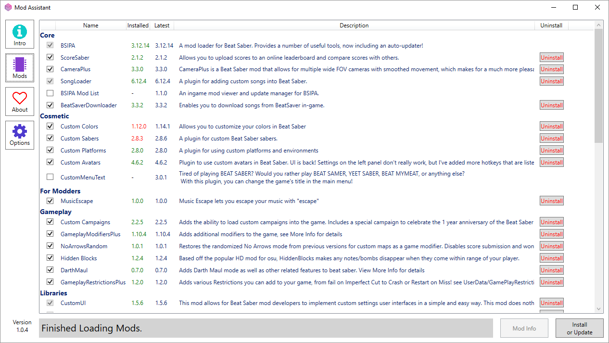
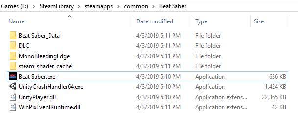
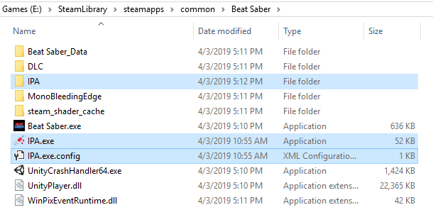
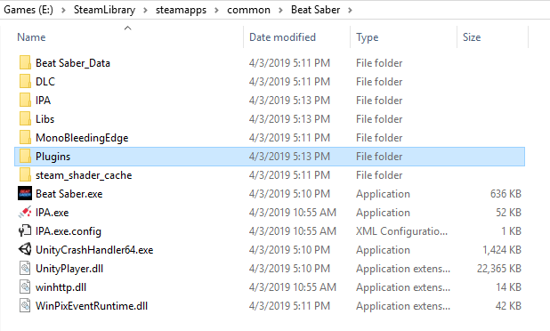
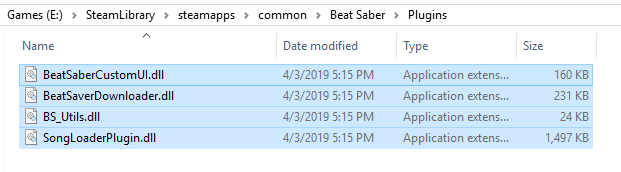

# PC Modding
# Preface

::: danger DISCLAIMER
Wenn Du Dich für die Verwendung von Mods entscheidest, musst Du verstehen dass...
- ...Du auf Probleme stoßen könntest, die es im Vanilla-Spiel nicht gibt. 99,9% der Bugs, Abstürze und Lags sind auf Mods zurückzuführen.
- ...Modifikationen durch Updates nicht mehr funktionieren. Das ist normal - sei geduldig und respektvoll, wenn eine Mod nicht direkt verfügbar ist, denn Modder sind Freiwillige die auch ein echtes Leben haben.
- ...die Entwickler nicht absichtlich veruchen, die Funktion von Mods zu unterbrechen. Sie wollen lediglich das Spiel weiterentwickeln und manchmal werden Mods dadurch nicht mehr funktionieren. Sie sind aber keineswegs darauf aus, Modding zu verbieten.

Beschwere Dich nicht bei den Entwicklern über Probleme im Zusammenhang mit Mods - Modder und Entwickler sind zwei getrennte Gruppen. Bitte sei einfach kein Idiot!
:::

Beat Saber unterstützt nativ selbst erstellte Songs, wenn das also alles ist, was Du suchst, musst Du keine weiteren Mods installieren! Es ist jedoch eine gute Idee, `SongCore` zu installieren, da diese Mod die Funktionalität des Basisspiels erweitert, um die Ladezeiten zu verbessern und Funktionen für andere Mods wie z.B. den Downloader im Spiel, benutzerdefinierte Ranglisten, Playlisten und vieles mehr bereitzustellen.

::: warning WARNUNG
Dieser Leitfaden gilt nur für das Modding unter Windows.  
Wenn Du eine Oculus Quest hast, lese Dir die [Quest-Modding-Seite](/quest-modding.md) durch.  
Wenn Du unter Linux zu Hause bist, sehe Dir bitte die [Informationen zum Linux-Modding](/modding/linux.md) oder [QBeat](https://github.com/geefr/beatsaber-linux-goodies/blob/master/README.md) an.
:::

Wenn Du irgendwann auf Probleme stoßen solltest, gehe bitte auf die [Support-Seite](./support) und schaue zuerst dort, ob Du herausfinden kannst, was schief gelaufen ist. Solltest Du hier keine Lösung finden, kannst Du anschließend im Support-Channel des Discord-Servers nachfragen. Wahrscheinlich findest Du die Antwort zu Deiner Frage jedoch auf dieser Seite!

## Installer
### ModAssistant
> **Dies ist der zum aktuellen Zeitpunkt empfohlene Weg, Mods zu installieren.**

__**Starte das Spiel mindestens einmal**__, bevor Du versuchst das Spiel zu modifizieren! Dies trifft ebenfalls zu, wenn es ein Update für Beat Saber gab, oder Du das Spiel neu installiert hast. 

Ein einfacher Beat Saber Mod-Installer, ähnlich wie der Mod-Manager, jedoch mit zusätzlichen Funktionen wie der Möglichkeit, Mods zu entfernen und zu Aktualisieren. Du kannst ModAssistant auf dem [GitHub-Account von Assistant](https://github.com/Assistant/ModAssistant/releases/latest) herunterladen.

## Wie bekomme ich mehr Songs?
### In-game Downloader
Mit der `BeatSaver Downloader` Mod kannst Du BeatMaps im Spiel selbst herunterladen, indem Du den `MORE SONGS` Button auf dem `MODS` Tab benutzt. Damit kannst Du Maps direkt von [BeatSaver](https://beatsaver.com) herunterladen.

### BeatSaver
[BeatSaver](https://beatsaver.com) ist das Haupt-Repository für von der Community erstellte BeatMaps. Viele andere Tools und Websites verbessern die Erfahrung beim Herunterladen der selbst erstellten BeatMaps, aber BeatSaber ist die Quelle der eigentlichen Daten.
Um die von der Website heruntergeladenen Maps zu installieren, entpacke sie in einen Ordner und lege diesen unter `Beat Saber/Beat Saber_Data/CustomLevels` ab. Du kannst auch die Ingame-Downloader-Mod, BeatList oder die OneClick-Installationsfunktion von ModAssistant verwenden.

### Beast Saber
[Beast Saber](https://www.bsaber.com) (bsaber.com) ist eine Website die versucht, die Suche nach coolen BeatMaps zum Spielen zu erleichtern. Das funktioniert, indem sie die Tausenden von Songs auf Beatsaver kategorisiert und Sie nach dem Genre eines Songs und vielen anderen Attributen sortiert. Beast Saber verfügt auch über ein vollwertiges Bewertungssystem, mit dem die Spieler BeatMaps bewerten und kommentieren können. Eine der am häufigsten genutzten Funktionen ist die Funktion "Curator recommended", bei der ein Team die meisten täglich veröffentlichten Maps durchspielt und diejenigen empfiehlt, die herausstechen. Du kannst diese [automatisch im Spiel herunterladen lassen](https://bsaber.com/beatsync/).

### Song Management Programme
* [BeatList](https://github.com/Alaanor/beatlist) ist eine App, die Dir das Verwalten von Playlisten und BeatMaps ermöglicht. Sie wird von Alaanor entwickelt.

### Playlisten
Platziere die Playlist-Datei in `Beat Saber/Playlists` und verwende anschließend [BeatList](https://github.com/Alaanor/beatlist) oder [Mod Assistant](https://github.com/Assistant/ModAssistant), um die BeatMaps herunterzuladen. (Hinweis: Ältere Mods erlaubten das Herunterladen der Inhalte von Wiedergabelisten im Spiel, aber dies ist derzeit nicht möglich).

## Installationsordner
_Wo ist mein Beat Saber installiert?_

### Standartordner
|  |  |
| --- | --- |
| Steam | `C:\Program Files (x86)\Steam\steamapps\common\Beat Saber\` |
| Oculus | `C:\Program Files\Oculus\Software\Software\hyperbolic-magnetism-beat-saber\` |

### Andere Ordner
**Falls Du den Installationsordner verschoben hast, könnte er sich auch an einem der folgenden Orte befinden.**  
Ersetze den Laufwerksbuchstaben `F` mit dem Laufwerk, auf dem Dein Spiel installiert ist.
|  |  |
| --- | --- |
| Steam | `F:\SteamLibrary\steamapps\common\Beat Saber\` |
| Oculus | `F:\Oculus\Software\Software\hyperbolic-magnetism-beat-saber\` |

## Deinstallation von Mods
Entferne entweder die .dll-Date aus dem `Plugins` Ordner, oder verwende den `Deinstallieren` Button in ModAssistant.

## Manuelle Installation
Ein Mod-Installer ist der empfohlene Weg, Mods zu installieren. Sieh Dir hierzu den Abschnitt [oben](#installers) an. Wenn Du das Spiel bereits gepatcht hast und nur Plugins installieren möchtest, die nicht im Installer verfügbar sind, fahre bitte mit Schritt 4 fort.

__**Starte das Spiel mindestens einmal**__, bevor Du versuchst das Spiel zu modifizieren! Dies trifft ebenfalls zu, wenn es ein Update für Beat Saber gab, oder Du das Spiel neu installiert hast. 
### Installiere BSIPA 
1. Lade [BSIPA](https://github.com/beat-saber-modding-group/BeatSaber-IPA-Reloaded/releases) herunter.
2. Navigiere zu Deinem [Installationsordner](#install-folder) und extrahiere BSPIA in diesen.

3. Führe die IPA.exe mit einem Doppelklick aus, um Dein Spiel zu patchen. Alle Mods, welche sich im `Plugins` Ordner befinden, sollten nun geladen werden, wenn Du das Spiel startest. Sollten irgendwelche Fehler auftreten, hast Du vermutlich Schritt 2 nicht richtig ausgeführt.

### Installieren von Mods
4. Lade die Mod(s) herunter, die Du installieren möchtest. Sei es von GitHub, dem #pc-mods Discord-Channel, oder anderen Quellen.  
**Stelle sicher, dass Du alle vom Mod benötigten Abhängigkeiten heruntergeladen hast.**

5. Einige Mods haben Installationsanweisungen, andere nicht. Im Allgemeinen kannst Du den Inhalt der Zip-Datei einfach per Drag-and-Drop in den Installationsordner von Beat Saber ziehen und die Dateien sollten in die entsprechenden Ordner wandern. 

## Wo Du weiterlesen kannst (und solltest)
* [Controllerhaltung und Ranking](./grips-and-tricks.md)
* [Erstellen von eigenen Beatmaps](/mapping/)
* [Erstellen von eigenen Schwertern](/models/custom-sabers.md)
* [Erstellen von eigenen Avataren](/models/custom-avatars.md)
* [Erstellen von eigenen Platformen](/models/custom-platforms.md)
* [Einrichtung von Multiplayer](https://bs.assistant.moe/Multiplayer/)
* [Entwicklung von Mods](/modding/)

## Hast Du Fragen?
Du kannst Dich gerne jederzeit an den Support-Channel des [BSMG Discord](https://discord.gg/beatsabermods) wenden!
