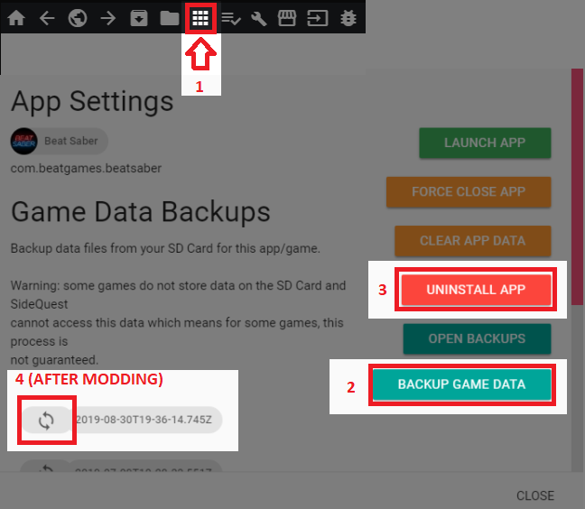
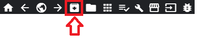
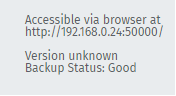
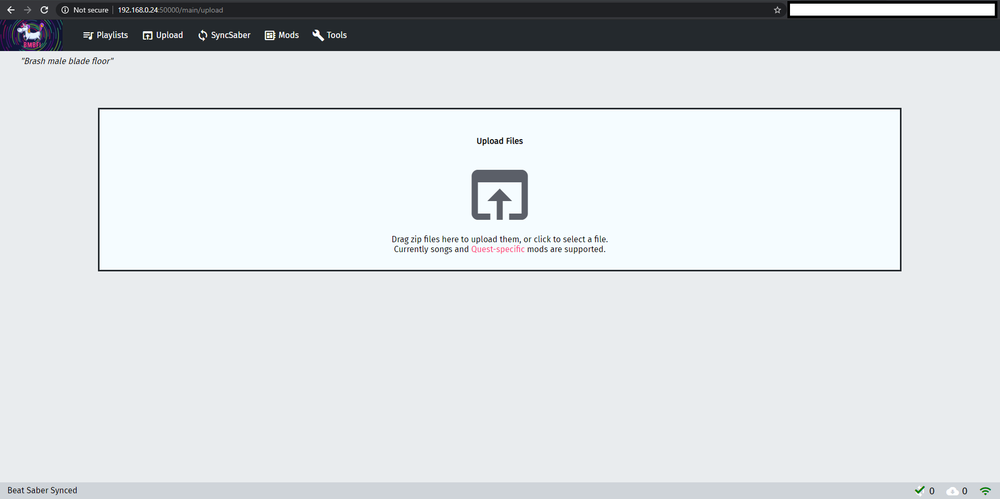

# Quest Modding

## Installation

Der zur Zeit einzige empfohlene Weg, um eigene BeatMaps und Mods auf der Quest zu installieren ist BMBF, welches Du über SideQuest installierst.
* [BMBF APK](https://bmbf.dev/stable)

### Installation von BMBF mit SideQuest

Falls Du SideQuest noch nicht heruntergeladen und eingerichtet hast, musst Du dies zuerst erledigen. Eine Anleitung dazu findest Du [hier](https://sidequestvr.com/#/setup-howto).

Öffne SideQuest und verbinde die Quest mit Deinem PC. Falls Du Beat Saber schon einmal modifiziert hast, oder Scores hast, die Du sichern möchtest, gehe zu `My Apps` in der Leite am oberen Rand des SideQuest-Fensters und suche nach Beat Saber.

Klicke das Zahnrad rechts an und drücke den `BACKUP GAME DATA` Button. Falls Du ein modifiziertes Spiel hast, musst Du es zusätzlich zuerst deinstallieren. Verwende hierzu den `UNINSTALL APP` Button.

Du kannst später Dein Backup auf dem gleichen Weg wiederherstellen, sobald Du Beat Saber gemoddet hast.

Installiere die aktuellste Version der BMBF APKs über den `Install APK from folder` Button, wie unten zu sehen:

Wenn Du die Installation von BMBF erfolgreich abgeschlossen hast, stelle bitte sicher, dass Du die neuste Version von Beat Saber installiert hast. **Diese Version darf nicht bereits gemoddet sein!** 
:::warning HINWEIS
Starte Beat Saber einmal, starte einen bleibigen Song und schließe es im Anschluss wieder, bevor du fortfährst!
:::

Nach dem Du einmal Beat Saber gestartet hast, musst Du BMBF über den Oculus TV Kanäle Tab oder über `Unbekannte Quellen` in Deiner Bibliothek öffnen. Folge jedem Schritt exakt wie beschrieben und Du solltest [bsaber.com](https://www.bsaber.com) sehen. Dies ist der Ort, an dem Du alle verfügbaren BeatMaps herunterladen kannst.

## Wiederherstellung des Backups

### Wiederherstellung über SideQuest

Gehe zum selben Menü zurück, das Du benutzt hast, um Deine Daten zu sichern und klicke den Button `OPEN BACKUPS`.  
Von dort, suche nach dem neusten Backup-Ordner, öffne diesen und lösche den `Mods` Ordner (dies verhindert, dass alte oder inkompatible Mods Dein Spiel zerstören).

Hiernach kannst Du zurück zum Menü gehen und den runden Pfeil neben Deinem letzten Backup anklicken. Dies stellt Deine Scores wieder her.
Der Button ist in [diesem Bild](#installing-bmbf-with-sidequest) markiert.

## Installation von Mods

:::warning WARNUNG
Stelle sicher, dass sich die Quest und Dein PC im selben Netzwerk befinden, bevor Du fortfährst!
:::

Öffne BMBF in Deiner Quest und wechsele auf den `Tools` Tab, dort solltest Du eine Web-Adresse und eine Versionsnummer so änlich wie unten sehen.

Offne einen Browser auf Deinem PC und gebe die Adresse aus der Quest in die Adressleiste Deines Browsers ein.

Du solltest nun den selben Bildschirm wie unten sehen.

Nun kannst Du einfach mit der Quest kompatible Mods per Drag-and-Drop in die Upload-Box ziehen und syncronisieren. Wenn die Mod ursprünglich für eine ältere Version von Beat Saber entwickelt wurde, wird diese nicht automatisch aktiviert. Um eine alte Mod zu aktivieren, welchsle in den `Mods` Tab und aktiviere die Mod dort.

Wenn Du auf Deiner Quest die gleiche Methode zum Herunterladen von Liedern wie in BMBF verwenden willst, kannst Du einfach `upload` in der URL durch `browser` ersetzen.

## Installation von Songs

### Innerhalb der Quest
Es gibt zwei Quellen für eigene BeatMaps innerhalb der Quest, indem Du den Browser verwendest.
* Falls Du nach empfohlenen Maps und Playlisten suchst, besuche [BeastSaber](https://bsaber.com/).
* Falls Dir das Design von BeastSaber nicht gefällt, kannst Du auch [Beatsaver](https://beatsaver.com/) ausprobieren.

Beide Seiten haben einen OneClickInstall-Button, mit dem Du einfach Maps auf Deiner Quest installieren kannst. Du kannst über das Weltkugelsymbol in der oberen rechten Ecke des Browsers zwischen den beiden Seiten wechseln.

### Über Deinen PC
Falls Du keine BeatMaps innerhalb Deiner Quest installieren kannst, kannst Du Maps auch, ähnlich wie Mods, über Deinen PC installieren. 
1. Besuche [BeastSaber](https://bsaber.com/) oder [Beatsaver](https://beatsaver.com/) auf deinem Computer.
2. Lade die Zip-Datei der Map herunter, die Du installieren möchtest.
3. Folge den Schritten unter [Installation von Mods](#installing-mods) bis zum Bildschirm, in dem Du die Dateien hochladen kannst.
4. Ziehe die Zip-Datei der Map per Drag-and-Drop auf die Upload-Fläche und sie sollte automatisch installiert werden.

:::tip 
Falls Du eine BeatMap auf der Quest testen möchtest, die Du selbst erstellt hast, schaue Dir den [Testen auf der Quest](/mapping/#testing-on-a-quest) Abschnitt im Mapping Wiki an.
:::

## Hilfreiche Links und alternative Anleitungen

* [Oculus Quest BMBF Installation Guide](https://bsaber.com/oculus-quest-custom-songs/)
* [Anleitung zum Lernen der Grundlagen für Asset Modding von Sc2ad](https://github.com/sc2ad/beat-saber-community-wiki/blob/master/asset-modding-guide.md)
* [Sammlung aller aktuellen Anleitungen für Asset Mods wie Schwerter und Blöcke von RedBrumbler](https://github.com/RedBrumbler/BMBFCustomSabers/wiki/RedBrumblers-Asset-Mod-Guide-Wiki)
* [QuestSaber Community](https://discord.gg/NXnPYEh) - Discord Server exklusiv zur Erstellung und Verwendung von Schwertern auf der Quest
* [Anleitung zum Erstellen von Qsabers](https://github.com/RedBrumbler/BMBFCustomSabers/wiki/Creating-Qsabers) - Schwerter speziell für die Quest, die auch nach Updates noch funktionieren sollten
* [Beheben von asynchronem Audio](https://bsaber.com/quest-out-of-sync/)

## Fehlerbehebung
### Das Hinzufügen von Mods aus dem Headset/bsaber.com funktioniert nicht
Der Grunnd, warum Du keine Mods und Schwerter von [Beastsaber](https://bsaber.com/) installieren kannst ist, dass diese nur für die Nutzung auf dem PC vorgesehen sind. Um Mods und Schwerter auf der Quest zu installieren, verwende bitte das [BMBF Web Interface](#installing-mods). 

Lade Dir kompatible Schwerter und Mods aus dem `#quest-mods` oder `#quest-assets` Channel im Beat Saber Modding Group Discord herunter, oder suche nach zur Quest kompatiblen Schwerterm auf [RedBrumbler's GitHub-Account](https://github.com/RedBrumbler/BMBFCustomSabers), oder in der [QuestSaber Community](https://discord.gg/NXnPYEh). Sobald Du die Zip-Dateien der Mods hast, kannst Du diese über das [BMBF Web Interface](#installing-mods) installieren.
___
### Das Sideloading von BMBF schlägt fehl
Während der Installation von BMBF bekommst Du den Fehler `INSTALL_FAILED_UPDATE_INCOMPATIBLE: Package com.weloveoculus.BMBF signatures do not match the previously installed version; ignoring!"`

Du musst zuerst die alte Version von BMBF von Deiner Quest deinstallieren. Dies kannst Du im `My Apps` Menü von SideQuest erledigen.
___
### Das BMBF Web-Interface läd nicht
Falls das Web-Interface von BMBF bei Dir nicht geladen werden kann, stelle bitte sicher, dass Du die aktuelle IP aus dem `Tools` Tab in Deinen Browser eingibst.
Stelle sicher, dass...
1) Deine IP nicht `127.0.0.1` ist
2) BMBF auf Deiner Quest geöffnet ist
3) Deine Adresse mit `http://` und **nicht** mit `https://` beginnt
4) Du `:50000` am Ende Deines Links hast
___
### BMBF läd auch nach mehreren Minuten die Konfiguration nicht
Dieser Fehler liegt vermutlich daran, dass Du eine alte Version von BeatSaber mit BMBF verwendest.
Falls Du doch eine aktuelle Version verwendest, versuche Dein Headset neu zu starten. Falls der Fehler hier nach immer noch auftritt, verwende den Button `QuickFix` im BMBF Web Interface. 
___
### Meine Schwerter und Mods lassen sich nicht aktivieren / funktionierten nicht!
Dies liegt vermutlich daran, dass Du eine veraltete Version des BMBF Client verwendest. Lade die neuste Version von [BMBF](https://bmbf.dev/stable) herunter. Falls BMBF noch nicht für Deine Version von Beat Saber verfügbar sein sollte, gebe bitte den Einhörnern ein wenig Zeit, bis diese BMBF aktualisiert haben.  
* Falls Deine Mod zu Deiner Version von BMBF kompatibel sein sollte, stelle bitte sicher, dass der Inhalt der Zip-Datei nicht von Ordnern getrennt wird. 
* Falls Deine BeatMap nicht geladen wird, versuche die Mapping Extension aus dem #quest-mods Discord Channel neu zu installieren.
* Falls Dein BMBF auf der aktuellsten Version ist und sich Deine Mods nicht aktivieren lassen, deinstalliere Beat Saber über den `Uninstall BS` Button in BMBF, installiere Beat Saber erneut und versuche, das Spiel erneut zu modden.
___
### Mein Beat Saber zeigt drei Punkte an, wenn ich es starte!
Falls Dein Beat Saber nach dem Start drei Punkte anzeigt, stelle sicher, dass...
1) Du das Spiel mindestens einmal gestartet und einen Song gespielt hast, bevor Du versuchst, das Spiel zu modifizieren
2) Du keine illegal erlangte Version von Beat Saber verwendest
3) Du die aktuellste Version von BMBF verwendest
